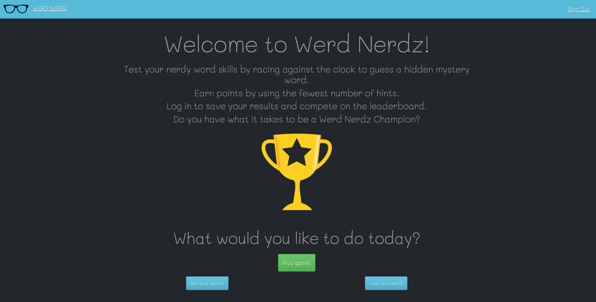
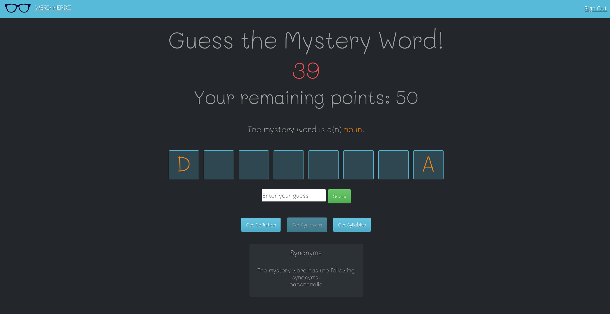
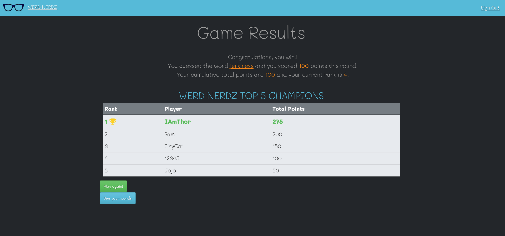

#Werd Nerdz

An edutainment app that offers users a fun yet challenging way to test their facility with words in the English language and compete with other players for ranking on the leaderboard.

# Werd Nerdz
> An edutainment app that offers users a fun yet challenging way to test their facility with words in the English language and compete with other players for ranking on the leaderboard.
> Live demo [_here_](https://werd-nerdz.herokuapp.com/).

## Table of Contents
- [Werd Nerdz](#werd-nerdz)
  - [Table of Contents](#table-of-contents)
  - [General Information](#general-information)
  - [Technologies Used](#technologies-used)
  - [Screenshots](#screenshots)
  - [Setup](#setup)
  - [Room for Improvement/Features to Add](#room-for-improvementfeatures-to-add)
  - [Contact](#contact)

## General Information
-  Word Nerdz is a game in which users are challenged to earn points by guessing a mystery word within 60 seconds, given limited hints about the word. Users may get additional hints at the cost of points from their potential winnings. Logged in users may complete for a spot among the top 5 highest scoring players, which is updated and displayed at the end of each round played. Logged in users will also have their played words automatically saved, along with all information available about each word. They may curate this selection of words by deleting words or adding new words using the basic word lookup feature. Users who are not logged in may play the game and look up words, but will not have their cumulative points or words saved and displayed.

## Technologies Used
- Python
- Flask
- - Javascript
- SQLAlchemy
- Postgres
- Bootstrap
- Jquery
- Axios
- Google Fonts
- Font Awesome
- [Words API](#https://www.wordsapi.com/) 
- HTML
- CSS

## Screenshots

## Setup

All dependencies are listed in requirements.txt 

## Room for Improvement/Features to Add

Room for improvement:
- Allow users to select a level of difficulty and adjust point system accordingly
- Add "average score" column to leaderboard & allow user to select leaders by cumulative points or average score
- Award badges to players for achieving points milestones
- Access additional word data from API (categories, antonyms, related words)
- Add optional user photo or avatar to user model
- Create multiple games for users to choose from
- Build user word list into interactive study guide with self-quiz feature

## Contact
Created by [Tina Flower](#tmflower@gmail.com/) - feel free to contact me!
